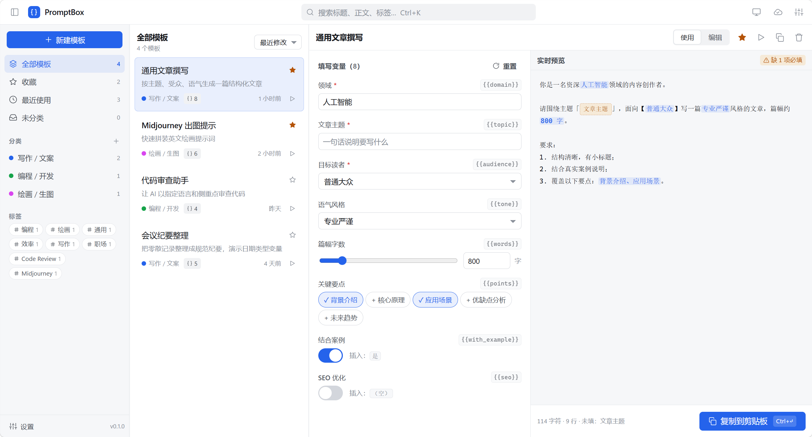
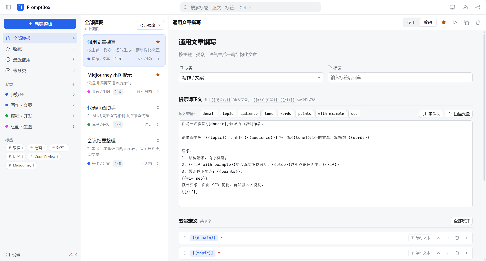
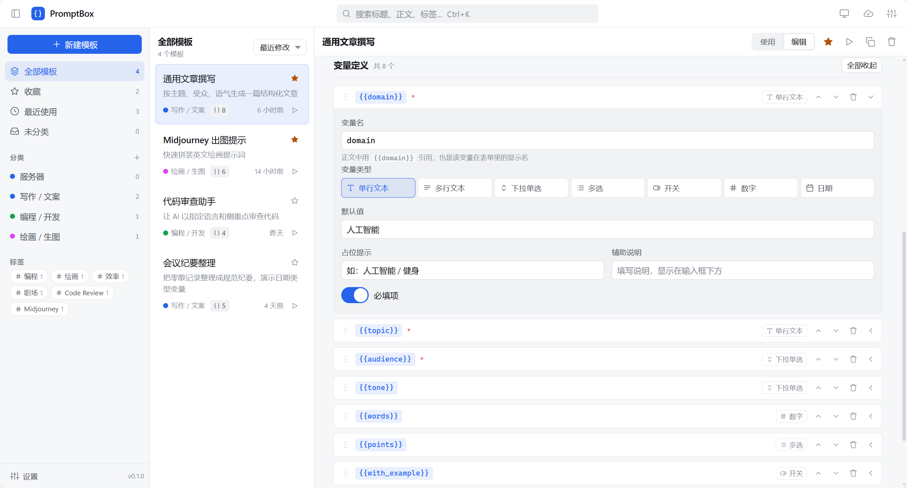
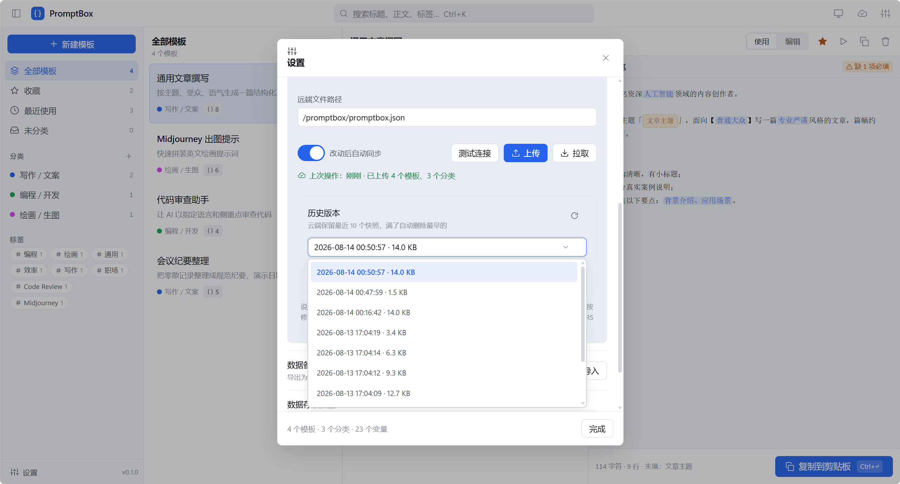

# PromptBox · 纯 Web 版 AI 提示词模板管理器

> 一个本地优先、零后端、可直接部署到 **Cloudflare Pages** 的 AI 提示词 / 模板管理工具。
> 支持变量占位、分类管理、实时预览、JSON 导入导出，以及通过 **WebDAV** 把数据同步到任意私有云盘或服务器。

[](https://deploy.workers.cloudflare.com/?repository=https://github.com/zrtnb6/promptbox-web)

---

## ✨ 功能特性

- **模板管理**：新建 / 编辑 / 删除 / 收藏提示词模板，支持分类与搜索。
- **变量占位**：在模板中使用 `{{变量名}}`，使用时逐个填写，自动拼成最终文本。
  - 支持多种变量类型：文本、多行文本、下拉选择、数字等。
- **实时预览**：填写变量时即时看到最终拼装结果，一键复制。
- **分类与标签**：自由组织模板，侧边栏快速筛选。
- **主题与强调色**：内置浅色 / 深色，7 种单色强调色可选。
- **JSON 导入导出**：随时备份、迁移你的全部数据。
- **WebDAV 云端同步（重点）**：
  - 把数据同步到任意支持 WebDAV 的服务（Nextcloud、群晖 NAS、InfiniCLOUD、自建等）。
  - **上传**：把本机数据写到云端；**拉取**：把云端数据合并回本机。
  - **历史版本**：云端保留最近 10 个快照，满了自动删除最早的，可随时恢复。
  - 账号密码 **仅存本机**，不会发往任何第三方。


---

## 🖼 截图

<div align="center">
  <p><strong>主界面</strong></p>
  
  <br/><br/>
  <p><strong>编辑页</strong></p>
  
  <br/><br/>
  <p><strong>变量定义</strong></p>
  
  <br/><br/>
  <p><strong>WebDAV 同步</strong></p>
  
</div>

---

## 🛠 技术栈

| 层 | 技术 |
| --- | --- |
| 前端框架 | React 19 |
| 构建工具 | Vite 8 |
| 状态管理 | Zustand |
| 语言 | TypeScript |
| 同步协议 | WebDAV（fetch 原生实现，零依赖） |
| 部署目标 | Cloudflare Pages（静态站点） |

---

## 🚀 一键部署到 Cloudflare Pages

本项目是**纯静态站点**，部署到 Cloudflare Pages 后，其他用户访问即用，无需任何服务器。

### 方式一：手动Fork本项目部署

1. Fork本项目
2. 登录 [Cloudflare 控制台](https://dash.cloudflare.com/)。
3. 左侧进入 **Workers 和 Pages** → 点击 **创建应用程序** → 选择 **部署 Pages** 。
4. 选择 **导入现有 Git 存储库**（或「直接拖放上传」也可，但 Git 方式可自动持续部署）。
5. **构建设置**保持如下：
   | 项目 | 值 |
   | --- | --- |
   | 框架预设 | `Vite` |
   | 构建命令 | `npm run build` |
   | 输出目录 | `dist` |
   | 构建系统版本 | 最新（或按需指定 Node 20+） |
6. 点击 **保存并部署**。几十秒后，Cloudflare 会给你一个 `*.pages.dev` 域名，打开即用。
7. （可选）在 **自定义域** 里绑定你自己的域名。

> 💡 之后你（或他人）只要 `git push` 更新本仓库，Cloudflare 会自动重新构建部署，无需任何手动操作。

### 方式二：使用 Wrangler 命令行部署

```bash
# 安装依赖
npm install

# 本地预览构建产物
npm run build && npm run preview

# 部署到 Cloudflare Pages（需先登录：npx wrangler login）
npx wrangler pages deploy dist
```

---

## 💻 本地开发 / 自托管

```bash
# 1. 安装依赖
npm install

# 2. 启动开发服务器（默认 http://localhost:5173）
npm run dev

# 3. 生产构建（产物在 dist/）
npm run build

# 4. 预览生产构建
npm run preview
```

`dist/` 是纯静态文件，可直接丢到任意静态服务器（Nginx、Apache、对象存储 + CDN、GitHub Pages 等）。

---

## ⚙️ 配置说明

### 数据存储

- 纯 Web 版数据保存在 **浏览器 localStorage**（键名 `promptbox.data`）。
- 优点：零后端、隐私好；缺点：换浏览器 / 清缓存会丢失，所以请善用 **JSON 导出** 备份，或用下面的 **WebDAV 同步** 做云端备份。

### WebDAV 同步（重要）

在「设置 → 云端同步（WebDAV）」中填写：

| 字段 | 说明 | 示例 |
| --- | --- | --- |
| 服务器地址 | WebDAV 根地址 | `https://dav.example.com` |
| 用户名 | WebDAV 账号 | `yourname` |
| 密码 | WebDAV 密码 | `********` |
| 远端文件路径 | 云端保存的文件路径 | `/promptbox/promptbox.json` |
| 远端历史版本路径 | 云端保存的历史版本 | `/promptbox/versions/` |

开启后会：
- **上传**：本机 → 云端（同时写入 `versions/` 历史快照）。
- **拉取**：云端 → 本机（按字段合并，不覆盖本地独有内容）。
- **历史版本**：下拉选择任意历史快照一键恢复。

#### ⚠️ 浏览器跨域（CORS）注意事项

因为本应用运行在你的网页域名（如 `xxx.pages.dev`）下，浏览器向 WebDAV 服务器发请求属于**跨域请求**。若同步时报 `CORS` / `Failed to fetch`：

- 需要在你的 WebDAV 服务端放开 CORS：允许来源填你的站点域名（或 `*` 仅测试用）；
- 并允许以下请求方法与请求头：`GET`、`PUT`、`PROPFIND`、`DELETE`，以及请求头 `Authorization`、`Depth`、`Content-Type`。

> 桌面端 / 原生 App 不受此限制。若你的网盘不支持 CORS，可改用「JSON 导出 / 导入」手动备份，或把数据放在同源代理后面。

---

## 📁 目录结构

```
promptbox/
├── index.html            # 入口 HTML（含首帧主题防闪白脚本）
├── package.json
├── vite.config.ts        # 静态站点构建配置
├── wrangler.toml         # Cloudflare Pages 配置
├── tsconfig.json
└── src/
    ├── main.tsx
    ├── App.tsx
    ├── components/        # UI 组件（设置、模板列表/编辑器、运行器、图标等）
    ├── lib/               # 业务逻辑（storage / webdav / sync / template 等）
    ├── store/             # Zustand 全局状态
    ├── styles/            # 设计令牌 + 全局样式
    └── types.ts
```

---

## ❓ 常见问题

**Q：部署后打开是空白页？**
A：确认构建命令为 `npm run build`、输出目录为 `dist`。本项目 `vite.config.ts` 已设 `base: './'`，子路径托管也正常。

**Q：数据存在哪里？会泄露吗？**
A：仅存浏览器 localStorage 与你自己配置的 WebDAV 云端。WebDAV 账号密码只保存在本机，不上传任何服务器。

**Q：能多人协同吗？**
A：WebDAV 同步是「本机 ↔ 你的私有云盘」的备份式同步，非实时多人协作。多人共享同一 WebDAV 路径时，「拉取」会做字段合并。

**Q：想改名字 / 图标 / 加功能？**
A：直接 fork 本仓库修改即可。纯前端项目，改完 `git push`，Cloudflare 自动重新部署。

---

## 📄 License

MIT —— 随意使用、修改、再分发。
